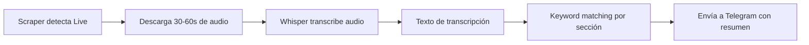

# 🎥 Plan: Análisis de Transmisiones en Vivo de Facebook

> **Estado:** Pendiente — esperando aprobación para implementar  
> **Fecha:** 21 Feb 2026

## Objetivo

Detectar transmisiones en vivo de Facebook, descargar un fragmento de audio, transcribirlo con IA (Whisper), y analizar el contenido para determinar el tema y hacer keyword matching igual que un post de texto.

---

## Flujo Propuesto

## Componentes a Modificar/Crear

### 1. Detección de Lives en `facebook.js`
- Identificar posts con indicador "EN VIVO" / "LIVE" en el DOM
- Extraer la URL del stream (m3u8 o video source)
- Marcar el post como `type: 'live'`

### 2. [NUEVO] `live-analyzer.js` — Módulo de análisis
- **Descargar fragmento**: Usar `ffmpeg` para capturar 30-60 segundos del stream
- **Transcribir**: Enviar audio a OpenAI Whisper API (o Whisper local)
- **Analizar**: Extraer keywords del texto transcrito
- **Resumir**: Generar resumen corto con GPT (opcional)

### 3. Modificar `indexMonitorAPI.js`
- Si un post es `type: 'live'`, llamar a `live-analyzer.js`
- Usar la transcripción como "texto" del post para keyword matching
- Enviar a Telegram con etiqueta `🔴 EN VIVO`

### 4. Dashboard — Indicador visual
- Badge "🔴 LIVE" en el feed para transmisiones activas
- Mostrar transcripción parcial como texto del post

---

## Dependencias Técnicas

| Componente | Opción A (Económica) | Opción B (Premium) |
|---|---|---|
| Captura de audio | `ffmpeg` (gratis, ya instalado) | Igual |
| Transcripción | Whisper API ($0.006/min) | Whisper local (gratis, requiere GPU) |
| Resumen | Keywords del texto transcrito | GPT-4o-mini ($0.001/resumen) |

### Costo estimado por live analizado
- **Solo transcripción**: ~$0.006 (30 segundos de audio)
- **Transcripción + resumen**: ~$0.007 total
- **Con 50 lives/día**: ~$0.35/día ≈ $10.50/mes

---

## Limitaciones

- ⏱️ **Delay**: Hay un retraso de ~1-2 minutos entre que inicia el live y se analiza
- 🔊 **Calidad**: Si el audio es malo (ruido, música), la transcripción será imprecisa
- 🌐 **Acceso**: Algunos lives pueden requerir estar logueado para acceder al stream
- 💾 **Storage**: Los fragmentos de audio se borran después de analizar

## Verificación

1. Encontrar una página con live activo
2. Confirmar que el scraper detecta el post como `type: 'live'`
3. Verificar que `ffmpeg` descarga el fragmento de audio
4. Validar que Whisper transcribe correctamente (al menos 70% precisión)
5. Confirmar que el keyword matching funciona con la transcripción
6. Verificar que llega a Telegram con etiqueta 🔴

---

> **Nota**: Este feature requiere una API key de OpenAI para Whisper.  
> Si ya tienes una, podemos usarla. Si no, la alternativa es instalar Whisper localmente en el servidor (requiere más memoria RAM).
