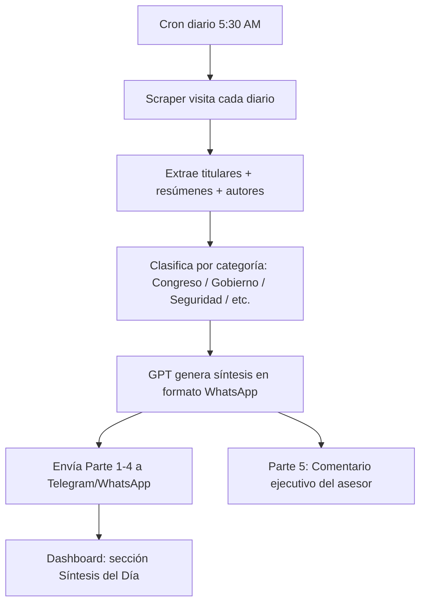

# 📰 Plan: Síntesis de Prensa Automatizada — Diarios de Morelos

> **Estado:** Pendiente — esperando links de los diarios para scraping  
> **Fecha:** 21 Feb 2026

## Objetivo

Automatizar la generación de la **Síntesis de Prensa Diaria** que actualmente se hace manualmente. El sistema scrapeará los principales diarios de Morelos y nacionales, extraerá titulares y resúmenes, y generará un reporte de 5 partes en formato WhatsApp listo para enviar.

---

## Formato de Salida (5 Partes)

| Parte | Contenido |
|---|---|
| **Parte 1** | Información Estatal: Portadas Morelos, Portadas Nacionales, Congreso, Gobierno, Judicial/Seguridad, Info General, Cuernavaca, Municipios |
| **Parte 2** | Columnas Estatales — análisis y opinión de columnistas locales |
| **Parte 3** | Información Nacional — notas relevantes de medios nacionales |
| **Parte 4** | Columnas Nacionales — análisis de columnistas nacionales |
| **Parte 5** | Comentario ejecutivo — análisis de asesor político para el Congreso de Morelos |

## Diarios a Scrapear

### Locales (Morelos)
- [ ] Diario de Morelos — `https://publicaciones.diariodemorelos.com/diario-de-morelos/YYYYMMDD` o `https://www.pressreader.com/es/newspapers/n/diario-de-morelos/YYYYMMDD`
- [ ] El Regional — `https://elregional.com.mx/` (Requiere buscar en la página principal el link de "Edición impresa de hoy [Fecha]")
- [ ] Lo de Hoy — `https://morelos.lodehoy.com.mx/sites/default/files/pdf/YYYY-MM/YYYYMMDD_morelos.pdf`
- [ ] La Jornada Morelos — `https://www.lajornadamorelos.mx/wp-content/uploads/YYYY/MM/LJM-No-[EDICION]-[MM]-[DD]-[YYYY].pdf` (La edición es secuencial, ej. 19 feb 2026 = No-01166)
- [ ] La Unión de Morelos — (Falta confirmar link exacto, usar approach similar)

### Nacionales (Cámara de Diputados - PDF con imágenes)
- [ ] Reforma — `https://comunicacion.diputados.gob.mx/sintesis/notas/whats/PRIMERAS/ref.pdf`
- [ ] El Universal — `https://comunicacion.diputados.gob.mx/sintesis/notas/whats/PRIMERAS/uni.pdf`
- [ ] La Jornada — `https://comunicacion.diputados.gob.mx/sintesis/notas/whats/PRIMERAS/jor.pdf`
- [ ] Excélsior — `https://comunicacion.diputados.gob.mx/sintesis/notas/whats/PRIMERAS/exc.pdf`

---

## Lógica de Extracción por Diario

1. **URLs por Fecha Simples**: Lo de Hoy, Diario de Morelos. Se formatea la fecha actual y se intenta descargar. 
2. **URLs Secuenciales**: La Jornada Morelos. Requiere calcular el número de edición base (ej. 19 Feb 2026 es 1166) y sumar los días de diferencia con la fecha actual.
3. **Scraping de Página Web**: El Regional. Se entra al home principal y se busca vía DOM el link que diga "edición impresa de hoy".
4. **PDFs de Nacionales (Imágenes)**: Son PDFs compartidos por Diputados que contienen imágenes, no texto elegible. Se requerirá usar un modelo de Visión (OpenAI GPT-4o) u OCR local (Tesseract / pdf2image) para extraer el texto de esas portadas antes de resumirlo.

---

## Flujo Técnico



## Componentes a Crear

### 1. `[NUEVO] press-scraper.js` — Scraper de periódicos
- Visitar cada URL de diario
- Extraer: titular, subtítulo, autor, sección, texto completo o resumen
- Identificar columnas de opinión vs notas informativas
- Guardar en `press-daily.json`

### 2. `[NUEVO] synthesis-generator.js` — Generador de síntesis
- Tomar los artículos del día
- Clasificar por categoría (Congreso, Gobierno, Seguridad, Municipios, etc.)
- Enviar a GPT-4o-mini con el prompt del usuario para generar las 5 partes
- Formatear en estilo WhatsApp (negritas con `*`, cursiva con `_`, monospace con ``` `)

### 3. `[NUEVO] endpoints en server.js`
- `GET /api/synthesis/today` — síntesis del día actual
- `GET /api/synthesis/:date` — síntesis de una fecha específica
- `POST /api/synthesis/generate` — forzar generación manual

### 4. Dashboard — Sección "Síntesis del Día"
- Nueva pestaña en el sidebar
- Vista de las 5 partes con formato legible
- Botón "Copiar para WhatsApp" por cada parte
- Historial de síntesis anteriores

---

## Prompt de GPT (Base del Usuario)

El prompt ya fue proporcionado por el usuario. Puntos clave:
- Formato WhatsApp: negritas con `*`, cursiva con `_`
- 5 partes independientes y numeradas
- No omitir ninguna nota, pero resumir las largas
- Parte 5: comentario ejecutivo como asesor político del Congreso
- Mención especial si aparece Isaac Pimentel Mejía o la Mesa Directiva
- Lenguaje claro, institucional y preciso

---

## Dependencias

| Componente | Tecnología | Costo |
|---|---|---|
| Scraping diarios | Playwright (ya instalado) | Gratis |
| Clasificación + síntesis | GPT-4o-mini API | ~$0.01-0.03/síntesis |
| Programación diaria | Node cron / PM2 | Gratis |
| Storage | JSON local | Gratis |

**Costo estimado:** ~$1/mes (una síntesis diaria con GPT-4o-mini)

---

## Pendientes del Usuario

- [ ] **Links de los diarios** — URLs exactas de las páginas de noticias a scrapear
- [ ] **API Key de OpenAI** — para GPT-4o-mini (si no tiene una)
- [ ] **Hora de ejecución** — ¿a qué hora debe estar lista la síntesis?
- [ ] **Canal de entrega** — ¿Telegram, WhatsApp, o solo Dashboard?
